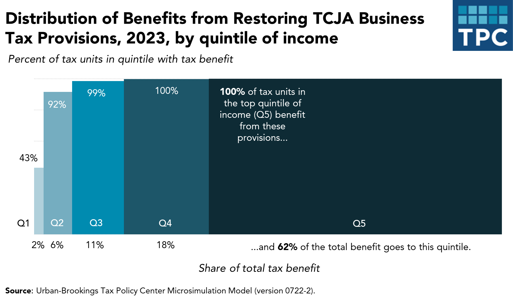
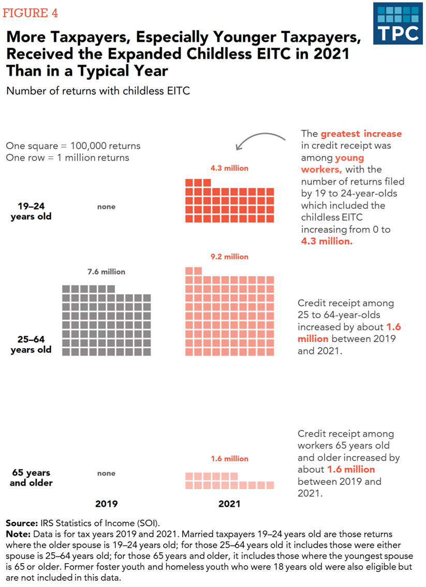
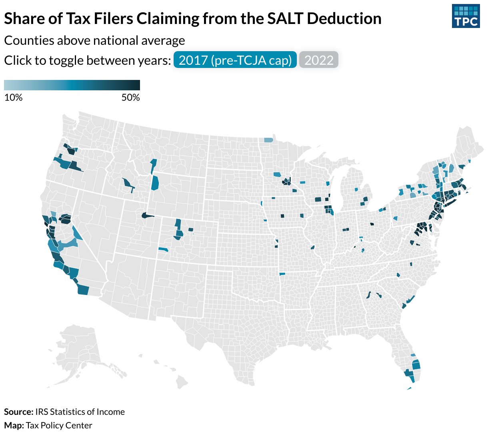
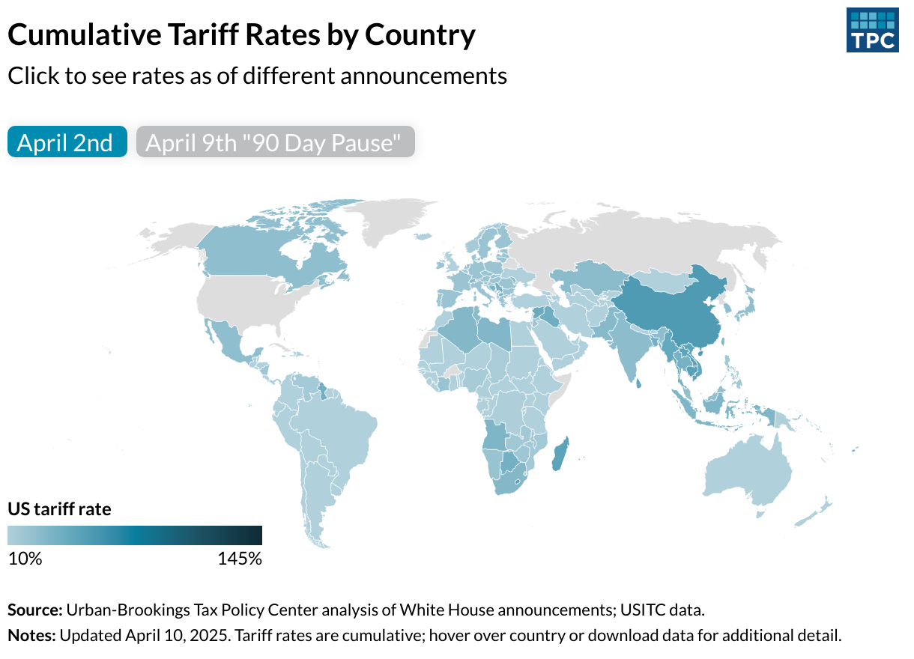
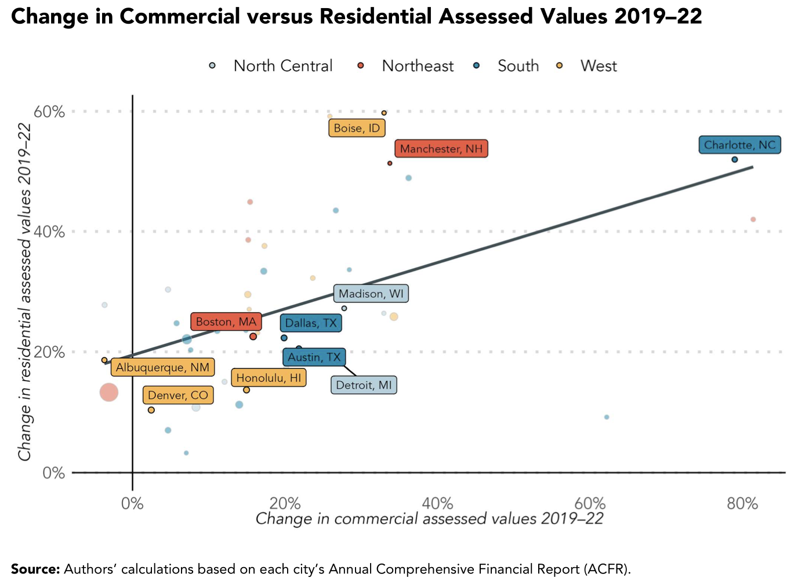

## R packages

```{=html}
<div style="margin-top:2rem;">

  <div style="display:flex; align-items:center; gap:1.5rem; margin-bottom:2rem;">
    <div style="flex-shrink:0;">
      <a href="https://github.com/UI-Research/tpcutil" target="_blank">
        
      </a>
    </div>
    <div>
      <h5 class="fw-bold mb-1">tpcutil</h5>
      <p class="mb-0">An R package providing utility functions for Tax Policy Center researchers. Includes tools for data wrangling, formatting, and common TPC workflows.</p>
    </div>
  </div>

  <div style="display:flex; align-items:center; gap:1.5rem; margin-bottom:2rem;">
    <div style="flex-shrink:0;">
      <a href="https://github.com/UI-Research/tpcthemes" target="_blank">
        
      </a>
    </div>
    <div>
      <h5 class="fw-bold mb-1">tpcthemes</h5>
      <p class="mb-0">An R package implementing Tax Policy Center ggplot2 themes and color palettes, enabling consistent and publication-ready data visualizations.</p>
    </div>
  </div>

</div>
```

## Portfolio
```{=html}
<div id="portfolioCarousel" class="carousel slide" data-bs-ride="false">

  <div class="carousel-indicators">
    <button type="button" data-bs-target="#portfolioCarousel" data-bs-slide-to="0" class="active" aria-current="true" aria-label="Slide 1"></button>
    <button type="button" data-bs-target="#portfolioCarousel" data-bs-slide-to="1" aria-label="Slide 2"></button>
    <button type="button" data-bs-target="#portfolioCarousel" data-bs-slide-to="2" aria-label="Slide 3"></button>
    <button type="button" data-bs-target="#portfolioCarousel" data-bs-slide-to="3" aria-label="Slide 4"></button>
    <button type="button" data-bs-target="#portfolioCarousel" data-bs-slide-to="4" aria-label="Slide 5"></button>
  </div>

  <div class="carousel-inner">

    <div class="carousel-item active">
      <a href="https://taxpolicycenter.org/feature/reassessing-tax-cuts-and-jobs-act" target="_blank">
        
      </a>
      <div class="carousel-caption">
        <h5><a href="https://taxpolicycenter.org/feature/reassessing-tax-cuts-and-jobs-act" target="_blank" class="text-white">Visualizing tax benefits for TPC feature on TCJA</a></h5>
        <p><span class="badge bg-secondary me-1">static</span><span class="badge bg-secondary">infographic</span> &nbsp; Jun 2024</p>
      </div>
    </div>

    <div class="carousel-item">
      <a href="https://taxpolicycenter.org/publications/how-american-rescue-plans-temporary-eitc-expansi-impacted-workers-without-children" target="_blank">
        
      </a>
      <div class="carousel-caption">
        <h5><a href="https://taxpolicycenter.org/publications/how-american-rescue-plans-temporary-eitc-expansi-impacted-workers-without-children" target="_blank" class="text-white">Waffle chart showing changes in tax credit eligibility</a></h5>
        <p><span class="badge bg-secondary me-1">static</span><span class="badge bg-secondary">infographic</span> &nbsp; Sep 2024</p>
      </div>
    </div>

    <div class="carousel-item">
      <a href="https://taxpolicycenter.org/taxvox/proposed-salt-cap-increase-expensive-boost-few-communies" target="_blank">
        
      </a>
      <div class="carousel-caption">
        <h5><a href="https://taxpolicycenter.org/taxvox/proposed-salt-cap-increase-expensive-boost-few-communies" target="_blank" class="text-white">Mapping the SALT Deduction</a></h5>
        <p><span class="badge bg-secondary me-1">interactives</span><span class="badge bg-secondary">maps</span> &nbsp; May 2025</p>
      </div>
    </div>

    <div class="carousel-item">
      <a href="https://taxpolicycenter.org/features/tracking-trump-tariffs" target="_blank">
        
      </a>
      <div class="carousel-caption">
        <h5><a href="https://taxpolicycenter.org/features/tracking-trump-tariffs" target="_blank" class="text-white">Mapping global tariff rates</a></h5>
        <p><span class="badge bg-secondary me-1">interactives</span><span class="badge bg-secondary">maps</span> &nbsp; May 2025</p>
      </div>
    </div>

    <div class="carousel-item">
      <a href="https://taxpolicycenter.org/sites/default/files/publication/165853/the-future-of-commerci-real-estate_2024-05-01.pdf" target="_blank">
        
      </a>
      <div class="carousel-caption">
        <h5><a href="https://taxpolicycenter.org/sites/default/files/publication/165853/the-future-of-commerci-real-estate_2024-05-01.pdf" target="_blank" class="text-white">Plotting changes in city property values</a></h5>
        <p><span class="badge bg-secondary me-1">static</span><span class="badge bg-secondary">infographic</span> &nbsp; May 2024</p>
      </div>
    </div>

  </div>

  <button class="carousel-control-prev" type="button" data-bs-target="#portfolioCarousel" data-bs-slide="prev">
    <span class="carousel-control-prev-icon" aria-hidden="true"></span>
    <span class="visually-hidden">Previous</span>
  </button>
  <button class="carousel-control-next" type="button" data-bs-target="#portfolioCarousel" data-bs-slide="next">
    <span class="carousel-control-next-icon" aria-hidden="true"></span>
    <span class="visually-hidden">Next</span>
  </button>

</div>

<style>
  .carousel-item img {
    max-height: 70vh;
    object-fit: contain;
    background-color: #f8f9fa;
  }
  .carousel-caption {
    position: static;
    text-align: left;
    color: #484A47 !important;
    padding: 0.75rem 0.25rem 0.5rem;
  }
  .carousel-caption h5 a {
    color: #484A47 !important;
  }
  .carousel-caption p {
    color: #484A47 !important;
  }
</style>
```

